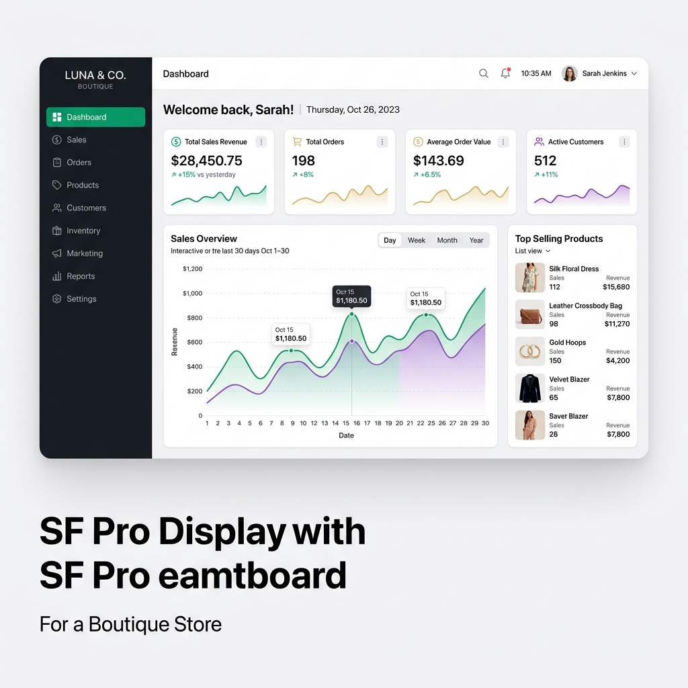

<div align="center">
  
  <h1>🚀 Fast-POS v2.0 (Native Desktop Edition)</h1>
  <p><strong>Sistema de Punto de Venta (POS) Nativo de Nivel Empresarial</strong></p>
</div>

Fast-POS ha evolucionado de una simple PWA web a un **Sistema de Punto de Venta (POS) Nativo de alto desempeño**. Funciona 100% *Offline-First* aprovechando el poder del hardware físico y el almacenamiento local mediante Electron y SQLite en modo C++. 

Totalmente equipado con un diseño que prioriza la experiencia humana, es la caja registradora del futuro para el mercado minorista tradicional.



## ✨ Características y Funcionalidades (Actualizado)

*   ⚡ **Cero Nubes (Zero-Cloud)**: Base de datos local transaccional ultrarrápida (SQLite3 nativo + protocolo WAL y Shared Memory) enlazada directamente al sistema de archivos del SO. Sin cierres por "caída de internet".
*   🛒 **Motor de Ventas Atómico**: Sistema de checkout robusto con soporte para instantáneas y almacenamiento persistente. Gestión atómica del inventario para evitar descuadres.
*   📦 **Gestión Inteligente de Catálogo**: CRUD de productos y categorías estricto. Búsqueda predictiva ultrarrápida, soporte nativo de Barcode Scanner y optimización automática de imágenes (<40KB).
*   📊 **Inteligencia de Negocio y Dashboard**: La analítica no es para contadores, es para dueños. Gráficas humanas y métricas clave ("Ganaste un 25% más que ayer"), listado de Top Products y reportes de desempeño en tiempo real.
*   🛡️ **Seguridad Zero-Trust y Auditoría Forense**: Todo movimiento de inventario o dinero genera un "Eco Silencioso" inmutable e imborrable, resguardando al negocio de fugas de capital y registrando la huella del cajero.
*   🔄 **Motor de Anulaciones y Diario**: Historial de recibos digitales con motor de anulación atómica para revertir cobros y restaurar el inventario de manera segura.
*   🖨️ **Hardware Físico Nativo**: Integración directa a bajo nivel con **impresoras térmicas (ESC/POS)** y circuitos de 12V para apertura de **Cajón de Dinero**. Múltiples perfiles de escáner de códigos de barras (POS, Catálogo, Diagnóstico).
*   🎨 **Tematización Dinámica Premium**: Soporte HSL dinámico con múltiples paletas (Ej. Muted Pastels, Modern Vibrants y modo Boutique) en Claro y Oscuro nativo a un clic de distancia.

## 🛠 Pila Tecnológica V2.0

El proyecto está orquestado bajo un ecosistema IPC (Inter-Process Communication) asíncrono y seguro:

*   **Motor Desktop**: [Electron 34](https://www.electronjs.org/) (Gestor IPC, hardware bridges y Native Wrappers).
*   **Motor UI**: [Next.js 15](https://nextjs.org/) (App Router, React 19) + [Tailwind CSS v4](https://tailwindcss.com/) + [shadcn/ui](https://ui.shadcn.com/) + Zustand.
*   **Almacenamiento**: [better-sqlite3](https://github.com/WiseLibs/better-sqlite3) (Transacciones síncronas compiladas en C para Node) + Dexie.js para PWA Web Testing.
*   **Impresión Térmica**: Buffers ESC/POS en crudo enviando colas lpd:// a puertos del SO (`react-thermal-printer`).

## ⚙️ Pantallas de Configuración (Wizard)

La aplicación cuenta con un instalador guiado altamente intuitivo para el setup de la empresa:

<div style="display: flex; flex-wrap: wrap; gap: 10px; justify-content: center;">
  
  
  
  
</div>

## 🚀 Guía de Desarrollo y Puesta en Marcha

Se requiere **Node.js v20+** (Recomendado) e instalación mediante manejador de paquetes (npm/pnpm).

### 1. Instalación
```bash
npm install
```

### 2. Semillas de Negocio (Simuladores de Demostración)
Comienza con una versión de la base de datos "llena de vida" para mostrar Analytics y gráficas:
```bash
# Simula historia financiera de una Papelería
npm run seed:paper

# (Nuevo) Catálogo y Demostración estilo Boutique
npm run seed:boutique
```

### 3. Entorno de Desarrollo Simultáneo
Al ser un ecosistema híbrido, Next.js y Electron deben compilarse al mismo tiempo:
```bash
npm run dev:native
```
*Esto abrirá la ventana nativa de Chromium gestionando la App e inicializará el panel de Salud de la DB SQLite.*

### 4. Empaquetado de Instaladores (Producción)
Fast-POS incluye soporte multiplataforma compilando binarios aislados y auto-contenidos.

```bash
# Compilar Instalador para macOS (DMG)
npm run dist:mac

# Compilar Instalador para Windows (EXE)
npm run dist:win
```

## 🛡 Licencia e Información
Fast-POS V2.0 posee una arquitectura `UNLICENSED` privada y soporta sistemas de **Llaves de Expiración** (License Keys limitadas por tiempo) para control de distribución.
